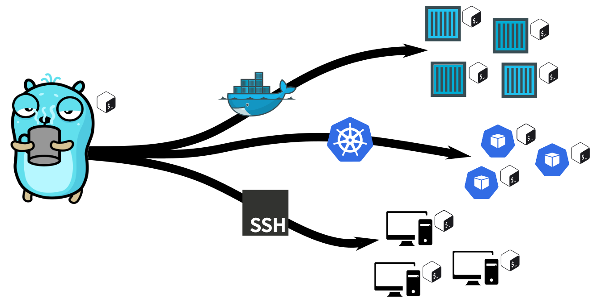

# go-multi-ssh
[![CC BY-NC-SA 4.0][cc-by-nc-sa-shield]][cc-by-nc-sa]




go-multi-ssh is a small tool used to execute commands on multiple remote machines. The current feature set allows
execution on

- multiple remote hosts via SSH
- multiple pods in a kubernetes cluster
- multiple container on a docker host

While the execution via SSH is done by a standalone program both kubernetes and docker integrates as
plugin ```kubectl mexec``` and ```docker mexec``` respectively.
Any contents streamed via ```stdout``` and ```stderr``` will be captured and printed on the local machine again
using ```stdout``` and ```stderr```.

# Usage

All three tools share a common set of features

- ```-c``` connection test

  Performs a simple connection test and prints all execution targets.


- ```-l none|block|inline``` label

  Sets a label type to mark the output with the source execution host.

  - ```none``` omits any output labels; the content will be delivered line-by-line regardless of the source
  - ```block``` prints a source label once per block; the next label will be printed after a different host sends text
    to ```stdout```
  - ```inline``` prints a source label for every line

## SSH specifics

- ```-i``` index file (defaults to ``./ssh_config``)

  Specifies an index file containing target hosts. The index file follows the ``ssh_config`` file format
  rules [SSH DOCs](https://www.ssh.com/academy/ssh/config#listing-of-client-configuration-options) but has an additional
  property ``tag``.
  For any host specified within the index file the systems ``ssh_config`` are used for fill missing connection infos.
  i.e.

  - ``~/.ssh/config``

      ````
      Host *
      IdentityFile ~/.ssh/%h_id_rsa

      Host target-host.lan
      User login
      ````

  - ``./ssh_config``

      ````
      Host target-host.lan
      ````

  Will lead to a login attempt using `login@target-host.lan` with the key file `~/.ssh/target-host.lan_id_rsa`.

- Tags

  Tags can be used to further narrow down the list of target hosts.

  Use :
  - ```-t``` to include

    Includes hosts with the given tag. i.e. ``mssh -t ubuntu``

  - ```-T``` to exclude

    Ignores hosts with the given tag. i.e. ``mssh -T critical``

  i.e. given the index file  ``./ssh_config`` with

  ````
  Host gateway.lan

  Host prox-host-1.lan
  Tag ubuntu
  Tag hypervisor
  
  Host ubuntu-1.lan
  Tag ubuntu
  
  Host dns.lan
  Tag ubuntu
  Tag dns
  
  Host dns.iot
  Tag ubuntu
  Tag dns
  
  Host dns.phone
  Tag ubuntu
  Tag dns
  
  Host mqtt-broker.iot
  Tag ubuntu
  
  Host home-assistant.iot
  Tag ubuntu
  
  ````
  The following calls will target :

  | call                             | gateway.lan | prox-host-1.lan | ubuntu-1.lan | dns.lan | dns.iot | dns.phone | home-assistant.iot | mqtt-broker.iot |    
    |----------------------------------|:-----------:|:---------------:|:------------:|:-------:|:-------:|:---------:|:------------------:|:---------------:|
  | ``mssh -t ubuntu``               |   &#9744;   |     &#9745;     |   &#9745;    | &#9745; | &#9745; |  &#9745;  |      &#9745;       |     &#9745;     | 
  | ``mssh -t ubuntu -T hypervisor`` |   &#9744;   |     &#9744;     |   &#9745;    | &#9745; | &#9745; |  &#9745;  |      &#9745;       |     &#9745;     | 
  | ``mssh -t dns``                  |   &#9744;   |     &#9744;     |   &#9744;    | &#9745; | &#9745; |  &#9745;  |      &#9744;       |     &#9744;     | 
  | ``mssh -t hypervisor``           |   &#9744;   |     &#9745;     |   &#9744;    | &#9744; | &#9744; |  &#9744;  |      &#9744;       |     &#9744;     | 
  | ``mssh``                         |   &#9745;   |     &#9745;     |   &#9745;    | &#9745; | &#9745; |  &#9745;  |      &#9745;       |     &#9745;     | 

## DOCKER specifics

- ```-s``` selector

  Specifies a selector to select target containers by filtering them using the container label
  feature. [Docker DOCs](https://docs.docker.com/engine/reference/commandline/run/#label).
  i.e. ``docker mexec -s "com.example.foo=bar"``

## K8S specifics

- ```-s``` selector

  Specifies a selector to select target pods by filtering them using the pod label feature.
  See [Kubernetes DOCs](https://kubernetes.io/docs/concepts/overview/working-with-objects/labels/#label-selectors).
  i.e. ``kubectl mexec -s "app.kubernetes.io/component=database"``


- ```-n``` namespace

  Specifies the target namespace. i.e. ``kubectl mexec -n kube-system``

# License

This work is licensed under a
[Creative Commons Attribution-NonCommercial-ShareAlike 4.0 International License][cc-by-nc-sa].

[![CC BY-NC-SA 4.0][cc-by-nc-sa-image]][cc-by-nc-sa]

# Resources

### Icons/Graphics

- [Bash](https://upload.wikimedia.org/wikipedia/commons/2/20/Bash_Logo_black_and_white_icon_only.svg)
- [Gopher](https://github.com/MariaLetta/free-gophers-pack/blob/master/preview/4.png)
- [Kubernetes Pod](https://github.com/kubernetes/community/blob/master/icons/svg/resources/unlabeled/pod.svg)
- [Kubernetes](https://upload.wikimedia.org/wikipedia/commons/3/39/Kubernetes_logo_without_workmark.svg)
- [Docker](https://upload.wikimedia.org/wikipedia/commons/4/4e/Docker_%28container_engine%29_logo.svg)
- [SSH](https://upload.wikimedia.org/wikipedia/commons/0/00/Unofficial_SSH_Logo.svg)
- [Computer](https://uxwing.com/computer-icon/)


[cc-by-nc-sa]: http://creativecommons.org/licenses/by-nc-sa/4.0/
[cc-by-nc-sa-image]: https://licensebuttons.net/l/by-nc-sa/4.0/88x31.png
[cc-by-nc-sa-shield]: https://img.shields.io/badge/License-CC%20BY--NC--SA%204.0-lightgrey.svg
